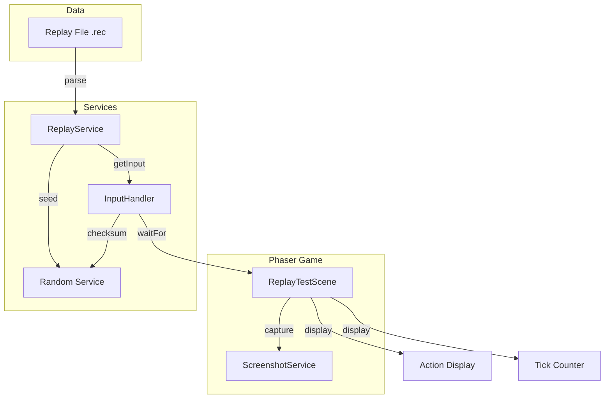

# Design Document: Replay Test Scene

## Overview

This design describes the TypeScript/Phaser implementation of the replay playback system, ported from the C codebase. The system consists of three main components:

1. **ReplayService** - Parses binary replay files and provides input actions at the correct simulation tick
2. **InputHandler** - Manages the fixed timestep game loop (60 ticks/second) and input processing
3. **ReplayTestScene** - A Phaser scene that visualizes replay playback with action display and screenshot integration

The replay system enables deterministic playback of recorded game sessions by:
- Reading the binary `.rec` file format (header + records)
- Seeding the RNG with the recorded seed for deterministic behavior
- Delivering recorded inputs at their exact tick timestamps
- Detecting RNG drift to identify desynchronization issues

## Architecture



### Data Flow

1. **Initialization**: ReplayTestScene loads a replay file via ReplayService
2. **Parsing**: ReplayService reads header, seeds RNG, and loads all records into memory
3. **Playback Loop**: InputHandler runs the fixed timestep loop, querying ReplayService for inputs
4. **Display**: ReplayTestScene updates UI with current tick and action information
5. **Screenshot**: User can capture screenshots at any point via ScreenshotService

## Components and Interfaces

### ReplayService

```typescript
// Replay file format constants
const REPLAY_MAGIC = "DREC";
const REPLAY_VERSION = 1;

// Binary structure sizes
const HEADER_SIZE = 12;  // 4 (magic) + 4 (version) + 4 (seed)
const RECORD_SIZE = 16;  // 8 (tick) + 4 (action) + 4 (checksum)

interface ReplayHeader {
    magic: string;      // 4 bytes: "DREC"
    version: number;    // 4 bytes: uint32
    rngSeed: number;    // 4 bytes: uint32
}

interface ReplayRecord {
    tick: number;       // 8 bytes: uint64 (stored as number, safe up to 2^53)
    action: number;     // 4 bytes: int32 (action bitmask)
    rngChecksum: number; // 4 bytes: uint32
}

interface ReplayData {
    header: ReplayHeader;
    records: ReplayRecord[];
}

interface ReplayServiceInterface {
    // Load and parse a replay file
    loadReplay(filePath: string): Promise<ReplayData | null>;
    
    // Initialize playback state
    initPlayback(data: ReplayData): void;
    
    // Get input for current tick (returns null if no input this tick)
    getInput(currentTick: number, expectedChecksum: number): ReplayRecord | null;
    
    // Check if playback is complete
    isComplete(): boolean;
    
    // Get current record index
    getCurrentRecordIndex(): number;
    
    // Get total record count
    getTotalRecords(): number;
    
    // Convert action bitmask to human-readable string
    actionToString(action: number): string;
}
```

### InputHandler

```typescript
// Input action bit flags (matching C implementation)
const INP_UP = 1 << 0;
const INP_DOWN = 1 << 1;
const INP_LEFT = 1 << 2;
const INP_RIGHT = 1 << 3;
const INP_ESC = 1 << 4;
const INP_LBUTTONP = 1 << 5;  // Left button pressed
const INP_LBUTTONR = 1 << 6;  // Left button released
const INP_RBUTTONP = 1 << 7;  // Right button pressed
const INP_RBUTTONR = 1 << 8;  // Right button released
const INP_NO_ESC = 1 << 10;
const INP_TIME = 1 << 11;
const INP_KEYBOARD = 1 << 12;
const INP_FUNCTION_KEY = 1 << 13;
const INP_SPACE = 1 << 14;
const INP_MOUSE = 1 << 15;
const INP_MOUSEWHEEL = 1 << 16;
const INP_QUIT = 1 << 17;

const TICKS_PER_SECOND = 60;

interface InputHandlerInterface {
    // Initialize the game loop
    init(): void;
    
    // Get current simulation tick
    getSimulationTick(): number;
    
    // Increment simulation tick (called each fixed timestep)
    incrementTick(): void;
    
    // Set wait ticks for timeout
    setWaitTicks(ticks: number): void;
    
    // Wait for input matching mask (simplified for test scene)
    // In full implementation, this would be async and block
    // For test scene, we simulate tick-by-tick
    simulateTick(): number | null;  // Returns action if one occurred this tick
}
```

### ReplayTestScene

```typescript
interface ReplayTestSceneState {
    replayData: ReplayData | null;
    isPlaying: boolean;
    currentTick: number;
    currentAction: string;
    currentRecordIndex: number;
    totalRecords: number;
}
```

## Data Models

### Binary File Format

The replay file uses little-endian byte order (matching the C implementation on x86/x64).

```
Offset  Size  Type     Description
------  ----  -------  -----------
0       4     char[4]  Magic bytes "DREC"
4       4     uint32   Version (1)
8       4     uint32   RNG seed

12+     16*N  records  Array of ReplayRecord

Record format:
Offset  Size  Type     Description
------  ----  -------  -----------
0       8     uint64   Tick number
8       4     int32    Action bitmask
12      4     uint32   RNG checksum
```

### Action Bitmask Values

| Bit | Constant | Value | Description |
|-----|----------|-------|-------------|
| 0 | INP_UP | 0x0001 | Up direction |
| 1 | INP_DOWN | 0x0002 | Down direction |
| 2 | INP_LEFT | 0x0004 | Left direction |
| 3 | INP_RIGHT | 0x0008 | Right direction |
| 4 | INP_ESC | 0x0010 | Escape key |
| 5 | INP_LBUTTONP | 0x0020 | Left button pressed |
| 6 | INP_LBUTTONR | 0x0040 | Left button released |
| 7 | INP_RBUTTONP | 0x0080 | Right button pressed |
| 8 | INP_RBUTTONR | 0x0100 | Right button released |
| 14 | INP_SPACE | 0x4000 | Space key |


## Implementation Details

### ReplayService Implementation

```typescript
export class ReplayService {
    private records: ReplayRecord[] = [];
    private currentIndex: number = 0;
    private header: ReplayHeader | null = null;

    async loadReplay(filePath: string): Promise<ReplayData | null> {
        // Use nw.js fs module to read binary file
        const fs = nw.require('fs');
        const buffer = fs.readFileSync(filePath);
        
        // Parse header (12 bytes)
        const magic = buffer.toString('ascii', 0, 4);
        if (magic !== REPLAY_MAGIC) {
            console.error(`Invalid magic: ${magic}`);
            return null;
        }
        
        const version = buffer.readUInt32LE(4);
        if (version !== REPLAY_VERSION) {
            console.error(`Version mismatch: ${version}`);
            return null;
        }
        
        const rngSeed = buffer.readUInt32LE(8);
        
        // Parse records
        const records: ReplayRecord[] = [];
        let offset = HEADER_SIZE;
        
        while (offset + RECORD_SIZE <= buffer.length) {
            // Read 64-bit tick as two 32-bit values (little-endian)
            const tickLow = buffer.readUInt32LE(offset);
            const tickHigh = buffer.readUInt32LE(offset + 4);
            const tick = tickLow + tickHigh * 0x100000000;
            
            const action = buffer.readInt32LE(offset + 8);
            const rngChecksum = buffer.readUInt32LE(offset + 12);
            
            records.push({ tick, action, rngChecksum });
            offset += RECORD_SIZE;
        }
        
        return {
            header: { magic, version, rngSeed },
            records
        };
    }

    initPlayback(data: ReplayData): void {
        this.header = data.header;
        this.records = data.records;
        this.currentIndex = 0;
        
        // Seed RNG
        rndInitWithSeed(data.header.rngSeed);
    }

    getInput(currentTick: number, expectedChecksum: number): ReplayRecord | null {
        if (this.currentIndex >= this.records.length) {
            return null;
        }
        
        const record = this.records[this.currentIndex];
        if (record.tick === currentTick) {
            // Check for RNG drift
            if (record.rngChecksum !== expectedChecksum) {
                console.warn(
                    `RNG Drift at tick ${currentTick}! ` +
                    `Recorded=0x${record.rngChecksum.toString(16)} ` +
                    `Expected=0x${expectedChecksum.toString(16)}`
                );
            }
            
            this.currentIndex++;
            return record;
        }
        
        return null;
    }

    actionToString(action: number): string {
        if (action === 0) return "NONE";
        
        const parts: string[] = [];
        if (action & INP_UP) parts.push("UP");
        if (action & INP_DOWN) parts.push("DOWN");
        if (action & INP_LEFT) parts.push("LEFT");
        if (action & INP_RIGHT) parts.push("RIGHT");
        if (action & INP_ESC) parts.push("ESC");
        if (action & INP_LBUTTONP) parts.push("LBTN_P");
        if (action & INP_LBUTTONR) parts.push("LBTN_R");
        if (action & INP_RBUTTONP) parts.push("RBTN_P");
        if (action & INP_RBUTTONR) parts.push("RBTN_R");
        if (action & INP_SPACE) parts.push("SPACE");
        if (action & INP_KEYBOARD) parts.push("KEY");
        if (action & INP_MOUSE) parts.push("MOUSE");
        
        return parts.join(" ");
    }

    isComplete(): boolean {
        return this.currentIndex >= this.records.length;
    }

    getCurrentRecordIndex(): number {
        return this.currentIndex;
    }

    getTotalRecords(): number {
        return this.records.length;
    }
}
```

### InputHandler Implementation

```typescript
export class InputHandler {
    private simulationTick: number = 0;
    private waitTicks: number = 0;
    private replayService: ReplayService | null = null;

    init(): void {
        this.simulationTick = 0;
    }

    setReplayService(service: ReplayService): void {
        this.replayService = service;
    }

    getSimulationTick(): number {
        return this.simulationTick;
    }

    incrementTick(): void {
        this.simulationTick++;
    }

    setWaitTicks(ticks: number): void {
        this.waitTicks = ticks;
    }

    // Simulate one tick and return action if one occurred
    simulateTick(): number | null {
        if (!this.replayService) return null;
        
        const checksum = rndGetChecksum();
        const record = this.replayService.getInput(this.simulationTick, checksum);
        
        this.incrementTick();
        
        return record ? record.action : null;
    }
}
```

### ReplayTestScene Implementation

The scene provides:
- File path input (or uses command-line argument)
- Play/Pause controls
- Current tick display
- Current action display (human-readable)
- Record progress (X of Y)
- Screenshot button

```typescript
export class ReplayTestScene extends Scene {
    private replayService: ReplayService;
    private inputHandler: InputHandler;
    private tickText: Phaser.GameObjects.Text;
    private actionText: Phaser.GameObjects.Text;
    private progressText: Phaser.GameObjects.Text;
    private isPlaying: boolean = false;

    create() {
        // Initialize services
        this.replayService = new ReplayService();
        this.inputHandler = new InputHandler();
        this.inputHandler.setReplayService(this.replayService);
        
        // Create UI elements
        this.createUI();
        
        // Load replay from command-line or default path
        this.loadReplayFile();
    }

    update(time: number, delta: number) {
        if (this.isPlaying && !this.replayService.isComplete()) {
            // Simulate ticks based on delta time
            // For simplicity, simulate one tick per frame at 60fps
            const action = this.inputHandler.simulateTick();
            
            this.updateDisplay(action);
        }
    }

    private updateDisplay(action: number | null) {
        const tick = this.inputHandler.getSimulationTick();
        const actionStr = action !== null 
            ? this.replayService.actionToString(action)
            : "NONE";
        const current = this.replayService.getCurrentRecordIndex();
        const total = this.replayService.getTotalRecords();
        
        this.tickText.setText(`Tick: ${tick}`);
        this.actionText.setText(`Action: ${actionStr}`);
        this.progressText.setText(`Record: ${current} / ${total}`);
    }
}
```


## Correctness Properties

*A property is a characteristic or behavior that should hold true across all valid executions of a system—essentially, a formal statement about what the system should do. Properties serve as the bridge between human-readable specifications and machine-verifiable correctness guarantees.*

### Property 1: Replay File Round-Trip

*For any* valid ReplayData (header with valid magic "DREC", version 1, any uint32 seed, and any array of ReplayRecords), serializing to binary format and parsing back SHALL produce an equivalent ReplayData object.

**Validates: Requirements 1.1, 1.3, 1.4, 1.7, 1.8**

This is a round-trip property that validates the binary parsing logic. We generate random valid replay data, serialize it to the binary format, then parse it back and verify equality.

### Property 2: Invalid Magic Rejection

*For any* binary data where the first 4 bytes do not equal "DREC", the parser SHALL return an error (null result) indicating invalid file format.

**Validates: Requirements 1.5**

### Property 3: Invalid Version Rejection

*For any* binary data with valid magic "DREC" but version number not equal to 1, the parser SHALL return an error (null result) indicating version mismatch.

**Validates: Requirements 1.6**

### Property 4: Playback Tick Progression

*For any* sequence of ReplayRecords with strictly increasing tick values, simulating N ticks SHALL:
- Return the action from record R when the simulation tick equals R.tick
- Advance to the next record after returning an action
- Return null for ticks that don't match any record's tick
- Signal completion when all records have been processed

**Validates: Requirements 2.3, 2.4, 2.5, 2.6**

### Property 5: Action Bitmask to String Conversion

*For any* action bitmask value, the string representation SHALL contain exactly the flag names for bits that are set:
- If bit 0 is set, string contains "UP"
- If bit 1 is set, string contains "DOWN"
- If bit 2 is set, string contains "LEFT"
- If bit 3 is set, string contains "RIGHT"
- If bit 4 is set, string contains "ESC"
- If bit 5 is set, string contains "LBTN_P"
- If bit 6 is set, string contains "LBTN_R"
- If bit 7 is set, string contains "RBTN_P"
- If bit 8 is set, string contains "RBTN_R"
- If bit 14 is set, string contains "SPACE"
- If action is 0, string equals "NONE"

**Validates: Requirements 3.1, 3.2, 3.3, 3.4, 3.5, 3.6, 3.7, 3.8, 3.9, 3.10, 3.11, 3.12**

### Property 6: RNG Drift Detection Continuity

*For any* replay playback where a record's rngChecksum differs from the current RNG checksum, the service SHALL:
- Log a warning (verifiable via mock/spy)
- Continue playback to the next record (not halt)

**Validates: Requirements 4.1, 4.2, 4.3**

## Error Handling

### File Loading Errors

| Error Condition | Handling |
|-----------------|----------|
| File not found | Return null, log error message |
| File read failure | Return null, log error with reason |
| Invalid magic bytes | Return null, log "Invalid magic: {actual}" |
| Version mismatch | Return null, log "Version mismatch: {version}" |
| Truncated file | Parse available records, ignore incomplete final record |

### Playback Errors

| Error Condition | Handling |
|-----------------|----------|
| RNG drift detected | Log warning with tick and checksums, continue playback |
| Mask mismatch | Log warning, return recorded action anyway |
| End of records | Signal completion via isComplete(), return null for getInput() |

### UI Errors

| Error Condition | Handling |
|-----------------|----------|
| No replay loaded | Display "No replay loaded" message |
| Playback complete | Display "Playback complete" message, stop updates |

## Testing Strategy

### Property-Based Testing

We will use **fast-check** as the property-based testing library for TypeScript.

Each property test will:
- Run minimum 100 iterations
- Use custom generators for ReplayData, ReplayRecord, and action bitmasks
- Be tagged with the property number and requirements reference

### Test File Organization

```
src-js/src/game/services/__tests__/
├── ReplayService.test.ts      # Unit tests
├── ReplayService.property.ts  # Property-based tests
├── InputHandler.test.ts       # Unit tests
└── generators.ts              # Custom fast-check generators
```

### Custom Generators

```typescript
// generators.ts
import * as fc from 'fast-check';

export const replayHeaderArb = fc.record({
    magic: fc.constant("DREC"),
    version: fc.constant(1),
    rngSeed: fc.nat(0xFFFFFFFF)
});

export const replayRecordArb = fc.record({
    tick: fc.nat(Number.MAX_SAFE_INTEGER),
    action: fc.integer({ min: 0, max: 0xFFFF }),
    rngChecksum: fc.nat(0xFFFFFFFF)
});

export const replayDataArb = fc.record({
    header: replayHeaderArb,
    records: fc.array(replayRecordArb, { minLength: 0, maxLength: 100 })
        .map(records => {
            // Ensure strictly increasing ticks
            let tick = 0;
            return records.map(r => {
                tick += fc.nat(100).generate(fc.random(Date.now()), undefined).value + 1;
                return { ...r, tick };
            });
        })
});

export const actionBitmaskArb = fc.integer({ min: 0, max: 0x7FFF });
```

### Unit Tests

Unit tests will cover:
- Specific examples of valid replay files
- Edge cases: empty records, single record, maximum tick values
- Error conditions: missing file, corrupt data
- UI state transitions

### Integration Tests

Integration tests will verify:
- End-to-end replay loading and playback
- Screenshot capture during playback
- NW.js filesystem integration

