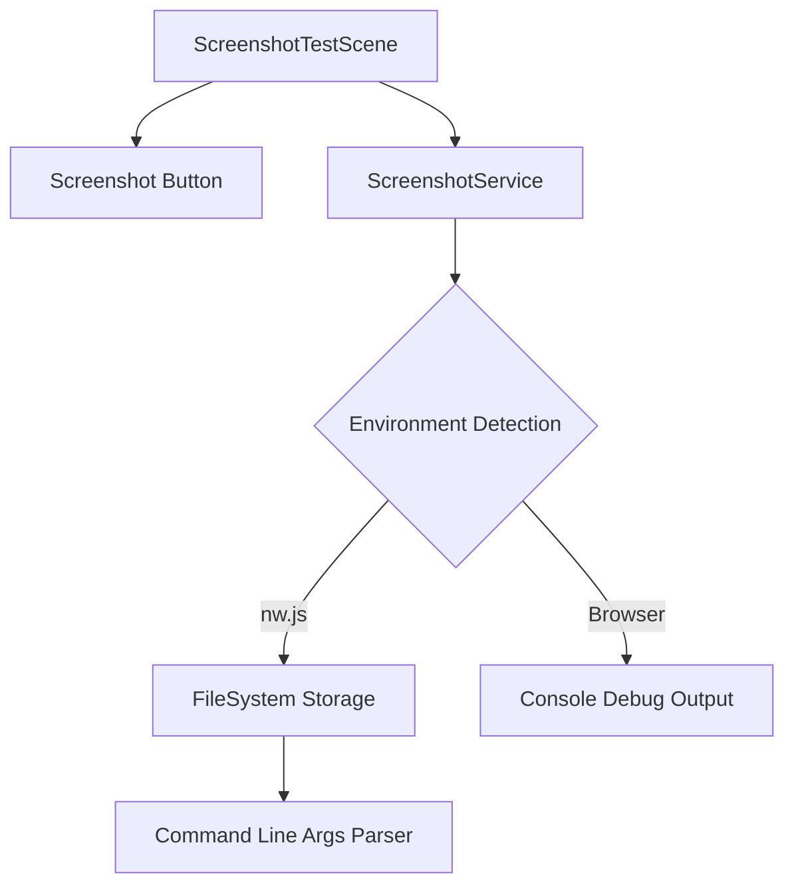

# Design Document: Screenshot Test Scene

## Overview

This design describes a simple test scene for the existing Phaser game that provides screenshot functionality with environment-aware storage. The implementation follows the existing scene pattern in the codebase and adds a service layer to handle the environment detection and screenshot persistence logic.

## Architecture



The architecture consists of:
1. **ScreenshotTestScene**: A Phaser Scene that renders the UI and handles user interaction
2. **ScreenshotService**: A utility module that handles environment detection and screenshot persistence
3. **Environment Detection**: Runtime check for nw.js availability
4. **Storage Backends**: Either filesystem (nw.js) or console output (browser)

## Components and Interfaces

### ScreenshotTestScene

A Phaser Scene class following the existing pattern in `src-js/src/game/scenes/`.

```typescript
class ScreenshotTestScene extends Phaser.Scene {
    constructor();
    create(): void;  // Sets up the blank scene and button
    private onScreenshotClick(): void;  // Handles button click
}
```

### ScreenshotService

A utility module that encapsulates environment detection and screenshot handling.

```typescript
interface ScreenshotResult {
    success: boolean;
    message: string;
    path?: string;
}

// Environment detection
function isNwjsEnvironment(): boolean;

// Get screenshot path from nw.js command line args
function getScreenshotPathFromArgs(): string | null;

// Save screenshot - handles both environments
function saveScreenshot(base64Data: string): ScreenshotResult;
```

### Button Component

A simple interactive text or rectangle that triggers the screenshot capture.

```typescript
// Created using Phaser's built-in text/graphics with interactive pointer events
// Styled to be visually identifiable as clickable
```

## Data Models

### ScreenshotResult

```typescript
interface ScreenshotResult {
    success: boolean;      // Whether the operation completed successfully
    message: string;       // Human-readable status message
    path?: string;         // Filesystem path where screenshot was saved (nw.js only)
}
```

### Command Line Arguments

In nw.js, the screenshot path is passed as a command-line argument:
```
nw . --screenshot-path=/path/to/screenshot.png
```

The argument is accessed via `nw.App.argv` array.


## Correctness Properties

*A property is a characteristic or behavior that should hold true across all valid executions of a system—essentially, a formal statement about what the system should do. Properties serve as the bridge between human-readable specifications and machine-verifiable correctness guarantees.*

### Property 1: Environment Detection Correctness

*For any* runtime environment, the `isNwjsEnvironment()` function SHALL return `true` if and only if the `nw` global object exists and has the expected structure (nw.App.argv accessible).

**Validates: Requirements 3.1, 4.1**

### Property 2: Command-Line Argument Parsing

*For any* array of command-line arguments containing an entry matching the pattern `--screenshot-path=<path>`, the `getScreenshotPathFromArgs()` function SHALL extract and return the `<path>` portion. For arrays without such an entry, it SHALL return `null`.

**Validates: Requirements 3.2**

### Property 3: Base64 Preview Extraction

*For any* non-empty base64 string, the preview function SHALL return exactly the first N characters (where N is configurable, default 50) of that string. For empty strings, it SHALL return an empty string.

**Validates: Requirements 4.3**

## Error Handling

| Error Condition | Handling Strategy |
|-----------------|-------------------|
| Missing screenshot path argument in nw.js | Log error message, return failure result |
| Filesystem write failure in nw.js | Catch exception, log error, return failure result |
| Screenshot capture failure | Catch exception, log error to console |
| Invalid base64 data | Log warning, proceed with available data |

## Testing Strategy

### Unit Tests

Unit tests will verify specific examples and edge cases:

1. **Scene Registration**: Verify ScreenshotTestScene is properly registered with the game
2. **Button Existence**: Verify the screenshot button is created in the scene
3. **Missing Argument Handling**: Verify error logging when screenshot path is missing
4. **Empty String Handling**: Verify preview function handles empty strings

### Property-Based Tests

Property-based tests will use a testing library (e.g., fast-check) to verify universal properties:

1. **Environment Detection**: Generate mock global objects and verify detection logic
2. **Argument Parsing**: Generate random argument arrays with/without screenshot-path entries
3. **Base64 Preview**: Generate random strings and verify preview extraction

Configuration:
- Minimum 100 iterations per property test
- Tests tagged with: **Feature: screenshot-test-scene, Property N: [property description]**
