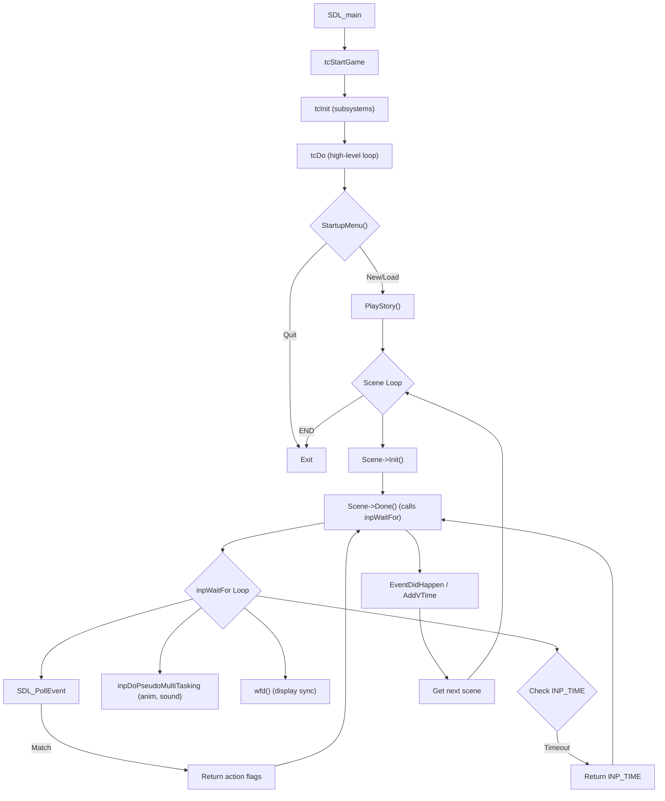

# Game Loop Analysis

This document provides a detailed analysis of the main game loop, input handling, time management, and randomness in the "Der Clou!" codebase.

---

## 1. Main Entry Point & Execution Flow

### 1.1 Entry Point
| Item | Value |
|------|-------|
| **File** | `src/theclou.c` |
| **Function** | `SDL_main` calls `tcStartGame` |

### 1.2 Initialization (`tcStartGame`)
- **File**: [base.c](file:///Users/ibauer/_ITS/DerClou/src/base/base.c#L455-541)
- **Function**: `tcStartGame(int argc, char **argv)`

**Initialization Order:**
1. `rndInit()` – Seeds RNG with `time(NULL)`.
2. `gfxInit()` – Graphics subsystem.
3. `inpOpenAllInputDevs()` – Input devices (keyboard, mouse, joystick).
4. `txtInit()` – Text/localization.
5. `InitAnimHandler()` – Animation system.
6. `dbInit()`, `InitAudio()`, `sndInit()`, `plInit()` – Data, audio, sound, planning.

After initialization, `tcDo()` is called to enter the main high-level gameplay loop.

### 1.3 High-Level Loop (`tcDo`)
- **File**: [base.c](file:///Users/ibauer/_ITS/DerClou/src/base/base.c#L260-303)

```c
while (sceneId == SCENE_NEW_GAME) {
    // Initialize story data
    while (!ret) ret = StartupMenu(); // Wait for user choice (New Game, Load, Quit)
    if (ret != 2) { // 2 = Quit
         sceneId = PlayStory(); // Enter the main scene loop
    } else {
         sceneId = SCENE_THE_END;
    }
    // Cleanup data and story
}
```

### 1.4 Scene Loop (`PlayStory`)
- **File**: [gp.c](file:///Users/ibauer/_ITS/DerClou/src/gameplay/gp.c#L134-264)

This is the **core gameplay driver**. It iterates through scenes, calling `Init()` and `Done()` callbacks for each.

```c
while ((curr->EventNr != SCENE_THE_END) && (curr->EventNr != SCENE_NEW_GAME)) {
    CheckConditions(curr);
    SceneArgs.ReturnValue = 0L;
    // Play sound, set story flags
    if (curr->Init) curr->Init();    // Scene setup (graphics, animations)

    if (curr->Done) curr->Done();    // Scene logic (menus, AI, user interaction)
    
    EventDidHappen(curr->EventNr);
    AddVTime(curr->Dauer);           // Advance in-game virtual time
    next = GetScene(SceneArgs.ReturnValue);
    curr = next;
}
```

> [!IMPORTANT]
> **There is no traditional per-frame update loop.** The game is **event-driven**. Input and time progression are handled inside `inpWaitFor()`, which is called by `Scene->Done()` functions (e.g., menu interactions, dialogs).

---

## 2. Input Handling

### 2.1 Core Handler: `inpWaitFor`
- **File**: [inphdl.c](file:///Users/ibauer/_ITS/DerClou/src/inphdl/inphdl.c#L276-503)
- **Signature**: `int32_t inpWaitFor(int32_t l_Mask)`

This is the **primary function for waiting on user input or timeouts**. It polls for SDL events in a loop.

### 2.2 Input Masks (`INP_*` flags)
Defined in [inphdl.h](file:///Users/ibauer/_ITS/DerClou/src/inphdl/inphdl.h#L25-50):

| Flag | Bitmask | Description |
|------|---------|-------------|
| `INP_UP` | `1 << 0` | Up direction (arrow/mouse/joystick) |
| `INP_DOWN` | `1 << 1` | Down direction |
| `INP_LEFT` | `1 << 2` | Left direction |
| `INP_RIGHT` | `1 << 3` | Right direction |
| `INP_ESC` | `1 << 4` | Escape key (auto-added if not `INP_NO_ESC`) |
| `INP_LBUTTONP` | `1 << 5` | Left mouse button pressed |
| `INP_LBUTTONR` | `1 << 6` | Left mouse button released |
| `INP_RBUTTONP` | `1 << 7` | Right mouse button pressed |
| `INP_RBUTTONR` | `1 << 8` | Right mouse button released |
| **`INP_TIME`** | `1 << 11` | **Timeout event** (see section 3.2) |
| `INP_KEYBOARD` | `1 << 12` | Generic keyboard input |
| `INP_FUNCTION_KEY` | `1 << 13` | F1-F11 keys |
| `INP_MOUSE` | `1 << 15` | Generic mouse input |
| `INP_MOUSEWHEEL` | `1 << 16` | Mouse wheel |
| `INP_QUIT` | `1 << 17` | Window close event |

**Convenience Macros:**
- `INP_BUTTON`: `INP_LBUTTONP | INP_RBUTTONP`
- `INP_MOVEMENT`: All directional inputs.
- `INP_ALL_MODES`: Most common inputs combined.

### 2.3 Loop Structure
```c
uint32_t timePrev = SDL_GetTicks();
while (!action) {
    while (SDL_PollEvent(&event)) {
        // Match event type to l_Mask, set action bits on match
    }
    inpDoPseudoMultiTasking(); // Run background animation and sound fading
    wfd();                     // Sync display, yield CPU

    WaitTime = SDL_GetTicks() - timePrev;
    if ((l_Mask & INP_TIME) && (WaitTime >= INP_TICKS_TO_MS(IHandler.ul_WaitTicks))) {
        action |= INP_TIME;    // Timeout reached
    }
}
return action;
```

### 2.4 `inpDoPseudoMultiTasking`
- **File**: [inphdl.c](file:///Users/ibauer/_ITS/DerClou/src/inphdl/inphdl.c#L206-226)
- **Role**: Executes background tasks during `inpWaitFor` loops.
- **Calls**:
    - `sndDoFading()`: Updates audio fade-in/fade-out.
    - `animator()`: Advances frame-based animations.
- **Frequency**: Triggered roughly once per logical "tick" defined by `INP_TICKS_TO_MS(1)`.

---

## 3. Time Management

### 3.1 Tick Constants
Defined in [inphdl.h](file:///Users/ibauer/_ITS/DerClou/src/inphdl/inphdl.h#L20-23):

| Constant | Value | Description |
|----------|-------|-------------|
| `INP_TICKS_PER_SECOND` | `60` | Intended frame/logic rate. |
| `INP_TICKS_TO_MS(t)` | `(t * 1000) / 60` | Converts ticks to milliseconds. E.g., 1 tick ≈ 16.67ms. |
| `INP_AS_FAST_AS_POSSIBLE` | `2` | Minimum wait ticks (~33ms). |

### 3.2 The Role of `INP_TIME`
> [!IMPORTANT]
> `INP_TIME` is **not** an event from SDL. It is a **timer flag** evaluated inside `inpWaitFor`.

**Mechanism:**
1. Caller sets `IHandler.ul_WaitTicks` via `inpSetWaitTicks(l_Ticks)`.
2. If `l_Mask` includes `INP_TIME`, the loop checks if elapsed wall-clock time exceeds `INP_TICKS_TO_MS(ul_WaitTicks)`.
3. If so, `action |= INP_TIME` is set, and the function returns.

**Primary Use Cases:**
- **Scene Fades**: `gfxChangeColors()` uses `inpWaitFor(INP_TIME)` for timed color interpolation.
- **Animation Timing**: Pacing animations during scene transitions.
- **Deliberate Pauses**: `inpDelay()` uses a similar loop.

### 3.3 Display Synchronization (`wfd` & `wfr`)
- **File**: [gfx.c](file:///Users/ibauer/_ITS/DerClou/src/gfx/gfx.c#L1266-1286)

| Function | Behavior |
|----------|----------|
| `wfr()` | If screen is dirty (`bGfxInvalidate` or `bGfxPaletteChanged`), calls `gfxUpdateSDL()`. Otherwise, `SDL_Delay(1)`. |
| `wfd()` | Wrapper for `wfr()`. (Historically for non-blocking vsync.) |

> [!NOTE]
> `SDL_Delay(1)` prevents 100% CPU spin when no rendering is needed. This is the main form of framerate limiting.

### 3.4 FPS / Loop Rate
- **No fixed FPS cap**: The game is event-driven, not frame-driven.
- **Effective Rate**: Controlled by `wfd()` delays and `INP_TIME` waits. Animations aim for 60 "ticks" per second.

---

## 4. Randomness

### 4.1 Implementation
- **File**: [random.c](file:///Users/ibauer/_ITS/DerClou/src/random/random.c)

| Function | Description |
|----------|-------------|
| `rndInit()` | `srand((unsigned int)time(NULL));` – Seeds RNG from wall-clock time. |
| `CalcRandomNr(l, u)` | `l + (rand() % (u - l))` – Standard C library `rand()`. |

### 4.2 Usage in Animation (`animator`)
- **File**: [sysanim.c](file:///Users/ibauer/_ITS/DerClou/src/anim/sysanim.c#L262-314)

The `animator()` function introduces **non-determinism** into frame timing:
```c
Handler.WaitCounter = Handler.PictureRate + CalcRandomNr(0, 3);
```
This adds a random delay of 0-2 ticks between animation frames.

> [!CAUTION]
> **Replay Determinism Impact:** For deterministic replays, both the RNG seed AND this randomness in animations must be controlled or disabled.

---

## 5. Summary Diagram



---

## 6. Key Files Reference

| Component | File | Key Functions |
|-----------|------|---------------|
| Entry / Init | [base.c](file:///Users/ibauer/_ITS/DerClou/src/base/base.c) | `tcStartGame`, `tcInit`, `tcDo` |
| Scene Loop | [gp.c](file:///Users/ibauer/_ITS/DerClou/src/gameplay/gp.c) | `PlayStory`, `GetStoryScene` |
| Input | [inphdl.c](file:///Users/ibauer/_ITS/DerClou/src/inphdl/inphdl.c) | `inpWaitFor`, `inpDelay`, `inpDoPseudoMultiTasking` |
| Input Defs | [inphdl.h](file:///Users/ibauer/_ITS/DerClou/src/inphdl/inphdl.h) | `INP_*` constants, `INP_TICKS_PER_SECOND` |
| Display Sync | [gfx.c](file:///Users/ibauer/_ITS/DerClou/src/gfx/gfx.c) | `wfr`, `wfd`, `gfxUpdateSDL` |
| Animation | [sysanim.c](file:///Users/ibauer/_ITS/DerClou/src/anim/sysanim.c) | `animator`, `PlayAnim`, `StopAnim` |
| Randomness | [random.c](file:///Users/ibauer/_ITS/DerClou/src/random/random.c) | `rndInit`, `CalcRandomNr` |

